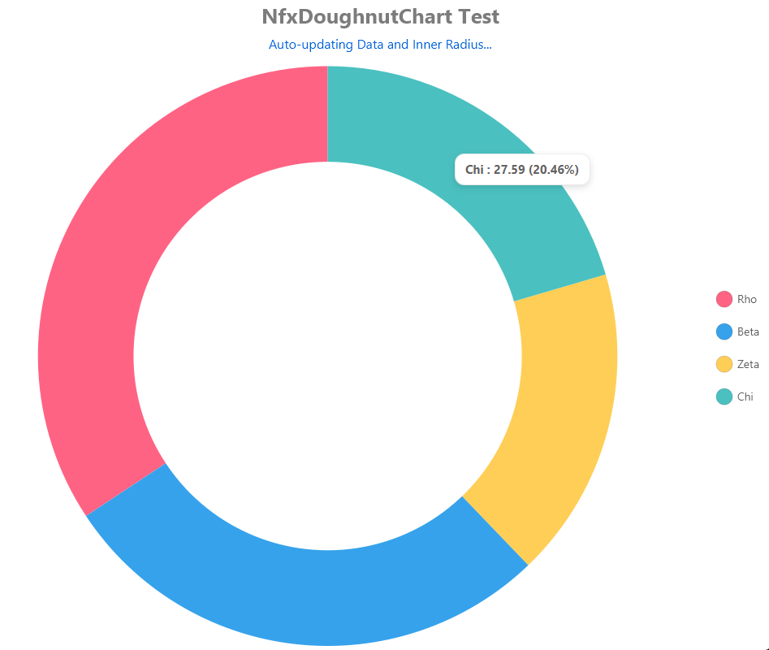

# NfxDoughnutChart — Full Guide (JavaFX)

A modern, skinnable doughnut chart control for JavaFX. This guide explains **every feature**, the **Java API properties**, and the **CSS hooks** you can use to style the control.

> Package: `xss.it.nfx.responsive.control` · Class: `NfxDoughnutChart<T extends DonutData<? extends Number>>`

---

## Screenshot


## Overview

- **Data-driven**: bind an `ObservableList<T>` where each `T` is a `DonutData` item (label + numeric value, optionally color).
- **Titles**: configurable chart title and subtitle (text + font + fill).
- **Legend**: toggle visibility, choose **position**, **order**, **marker shape**, sizes and gaps, label font/fill, and auto‑hide behavior.
- **Doughnut shape**: control inner radius (0–100%), creating anything from a pie to a thin ring.
- **Tooltips**: opt‑in popup per slice.
- **Animation**: enable/disable and tune the delay between slice animations.
- **Responsive tweaks**: auto‑hide legend when the chart becomes too small (configurable thresholds).

---

## Quick start (programmatic)

```java
NfxDoughnutChart<DonutData<Number>> chart = new NfxDoughnutChart<>();
chart.setTitle("Revenue by Segment");
chart.setSubtitle("FY 2025 YTD");

chart.setAnimated(true);
chart.setAnimationDelay(400); // ms between slice animations
chart.setPopupEnabled(true);  // tooltips on hover

// Legend
chart.setShowLegend(true);
chart.setLegendPosition(LegendPos.RIGHT);
chart.setLegendOrder(LegendOrder.AS_IS);
chart.setLegendMarkerShape(LegendMarkerShape.CIRCLE);

// Layout & shape
chart.setBorderGap(12);  // px padding from chart bounds to drawing area
chart.setInnerRadius(55); // 0..100 (% of outer radius)

// Optional: let the chart auto‑hide legend when too small:
chart.setLegendAutoHide(true);
chart.setLegendAutoHideMinWidth(560);
chart.setLegendAutoHideMinHeight(320);

// Data: supply an ObservableList<T> of DonutData items
// chart.setData(FXCollections.observableArrayList(item1, item2, ...));
```

> **Defaults (code):** see the full property table below. Most visual defaults can also be controlled from CSS.

---

## CSS quick start

Attach a stylesheet to your scene or root and target the chart's style class **`nfx-doughnut-chart`**:

```css
.nfx-doughnut-chart {
    -nfx-chart-background: #ffffff;

    /* Titles */
    -nfx-title-font: bold 26 "Segoe UI";
    -nfx-title-fill: #7c7c7c;

    -nfx-subtitle-font: 16 "Segoe UI";
    -nfx-subtitle-fill: #0060da;

    /* Layout & shape */
    -nfx-border-gap: 5;      /* px */
    -nfx-inner-radius: 50;   /* 0..100 percent */

    /* Legend */
    -nfx-legend-square-size: 20;          /* px */
    -nfx-legend-gap: 6;                   /* px between marker and label */
    -nfx-legend-item-gap: 30;             /* px between items */
    -nfx-legend-line-gap: 20;             /* px between rows */
    -nfx-legend-marker-corner-radius: 4;  /* px, when shape=ROUNDED */

    -nfx-legend-label-font: 14 "Segoe UI";
    -nfx-legend-label-fill: #626262;
}
```

**Slice colors** use the standard JavaFX series color classes. This stylesheet maps each `.default-colorN` to a custom property `-nfx-doughnut-color`, which the control uses as its segment paint:

```css
.default-color0.nfx-doughnut-chart { -nfx-doughnut-color: #FF6384; }
.default-color1.nfx-doughnut-chart { -nfx-doughnut-color: #36A2EB; }
/* ... up to .default-color19 ... */
```

> You can override these in your own CSS to theme the palette.

---

## Java API — properties (code)

| Property (Java) | Type | Default (code) | CSS hook | Description |
|---|---|---:|---|---|
| `data` | `ObservableList<T>` | empty list | — | Items to render (each `T` extends `DonutData<? extends Number>`). |
| `title` | `String` | `"NfxDoughnutChart"` | — | Main chart title (text content). |
| `titleFont` | `Font` | `Font.getDefault()` | `-nfx-title-font` | Font for the title. |
| `titleFill` | `Paint` | `#444` | `-nfx-title-fill` | Text fill for the title. |
| `subtitle` | `String` | `"Subtitle"` | — | Subtitle (text content). |
| `subtitleFont` | `Font` | `Font.getDefault()` | `-nfx-subtitle-font` | Font for the subtitle. |
| `subtitleFill` | `Paint` | `#777` | `-nfx-subtitle-fill` | Text fill for the subtitle. |
| `chartBackground` | `Paint` | `null` | `-nfx-chart-background` | Fills the chart plot area (under the ring). Accepts colors or gradients. |
| `borderGap` | `double` (px) | `20` | `-nfx-border-gap` | Padding from control bounds to the chart drawing area. |
| `innerRadius` | `double` (0..100) | `50` | `-nfx-inner-radius` | Donut hole radius as a percentage of outer radius (`0` = pie, `100` = invisible ring). Values are clamped to [0,100]. |
| `animated` | `boolean` | `true` | — | Enables slice reveal animation. |
| `animationDelay` | `double` (ms) | `500` | — | Delay between slice animations. |
| `popupEnabled` | `boolean` | `true` | — | Enables per-slice popup/tooltip. |
| `showTitle` | `boolean` | `true` | — | Toggles title visibility. |
| `showSubtitle` | `boolean` | `true` | — | Toggles subtitle visibility. |
| `showLegend` | `boolean` | `true` | — | Toggles legend visibility. |
| `legendPosition` | `LegendPos` | `RIGHT` | — | Where the legend is placed relative to the chart (e.g., `RIGHT`, `LEFT`). |
| `legendOrder` | `LegendOrder` | `AS_IS` | — | Ordering for legend items (e.g., preserve data order). |
| `legendMarkerShape` | `LegendMarkerShape` | `CIRCLE` | — | Shape for legend markers (`CIRCLE`, `SQUARE`, `ROUNDED`). |
| `legendSquareSize` | `double` (px) | `20` | `-nfx-legend-square-size` | Size of legend marker square. |
| `legendGap` | `double` (px) | `8` | `-nfx-legend-gap` | Space between marker and its label. |
| `legendItemGap` | `double` (px) | `14` | `-nfx-legend-item-gap` | Horizontal space between legend items. |
| `legendLineGap` | `double` (px) | `20` | `-nfx-legend-line-gap` | Vertical gap between legend rows. |
| `legendLabelFont` | `Font` | `Font.getDefault()` | `-nfx-legend-label-font` | Font for legend labels. |
| `legendLabelFill` | `Paint` | `#333` | `-nfx-legend-label-fill` | Text fill for legend labels. |
| `legendAutoHide` | `boolean` | `true` | — | If `true`, the legend auto‑hides when empty or when below size thresholds. |
| `legendAutoHideMinWidth` | `double` (px) | `560` | — | Minimum chart width required to show the legend when auto‑hide is on. |
| `legendAutoHideMinHeight` | `double` (px) | `320` | — | Minimum chart height required to show the legend when auto‑hide is on. |

> **Note on defaults:** code defaults are what you get if you do nothing. The provided default stylesheet can override the **visual** defaults (e.g., fonts, fills, gaps) for a more polished look.

---

## CSS reference — all supported properties

Units marked **px** are device pixels. **Paint** accepts solid colors or gradients. **Font** uses JavaFX's font shorthand (e.g., `bold 16 "Segoe UI"`).

| CSS Property | Type | Default (theme CSS) | Maps to | Notes |
|---|---|---|---|---|
| `-nfx-chart-background` | Paint | `#ffffff` | `chartBackground` | Fills chart area behind the ring. |
| `-nfx-border-gap` | Number (px) | `5` | `borderGap` | Space from control borders to plot. |
| `-nfx-title-font` | Font | `bold 26 "Segoe UI"` | `titleFont` | Title font (weight, size, family). |
| `-nfx-title-fill` | Paint | `#7c7c7c` | `titleFill` | Title text color. |
| `-nfx-subtitle-font` | Font | `16 "Segoe UI"` | `subtitleFont` | Subtitle font. |
| `-nfx-subtitle-fill` | Paint | `#0060da` | `subtitleFill` | Subtitle text color. |
| `-nfx-inner-radius` | Number (0..100) | `50` | `innerRadius` | Donut hole radius as a percent of outer radius. |
| `-nfx-legend-square-size` | Number (px) | `20` | `legendSquareSize` | Marker square size. |
| `-nfx-legend-gap` | Number (px) | `6` | `legendGap` | Gap between marker and label. |
| `-nfx-legend-item-gap` | Number (px) | `30` | `legendItemGap` | Gap between items. |
| `-nfx-legend-line-gap` | Number (px) | `20` | `legendLineGap` | Gap between rows. |
| `-nfx-legend-marker-corner-radius` | Number (px) | `4` | `legendMarkerCornerRadius` | Used when marker shape = `ROUNDED`. |
| `-nfx-legend-label-font` | Font | `14 "Segoe UI"` | `legendLabelFont` | Legend label font. |
| `-nfx-legend-label-fill` | Paint | `#626262` | `legendLabelFill` | Legend label color. |

### Slice color mapping

| Selector | Effect |
|---|---|
| `.default-colorN.nfx-doughnut-chart { -nfx-doughnut-color: <paint>; }` | Sets the N‑th slice color. |
| `.nfx-doughnut-chart { -fx-background-color: -nfx-doughnut-color; }` | Applies the custom property to slice fills internally. |

Provide up to `N = 19` out of the box; extend as you need.

---

## Tooltip / popup styling

When `popupEnabled` is `true`, the control uses a popup with these style classes:

- **`.nfx-doughnut-popup`** — container (rounded panel, subtle border and drop shadow).
- **`.nfx-doughnut-popup-label`** — text label inside the popup.

Default styles give a light, readable tooltip. You can override padding, radius, border, shadow, and text font/fill in your CSS.

```css
.nfx-doughnut-popup {
    -fx-background-color:
        linear-gradient(to bottom, rgba(255,255,255,0.98), rgba(252,252,252,0.98)),
        white;
    -fx-background-insets: 0, 1;
    -fx-background-radius: 12, 11;
    -fx-padding: 8 12;
    -fx-border-color: rgba(0,0,0,0.07);
    -fx-border-width: 1;
    -fx-border-radius: 12;
    -fx-effect: dropshadow(gaussian, rgba(0,0,0,0.10), 12, 0.20, 0, 3);
}

.nfx-doughnut-popup-label {
    -fx-font-size: 15;
    -fx-font-weight: bold;
    -fx-text-fill: #646464;
    -fx-wrap-text: false;
    -fx-padding: 0;
}
```
Or you can implement your own popup factory & style classes. Be creative :)
```java
    private static <D extends DonutData<? extends Number>> ChartCallBack<D, Parent, NfxDoughnutChart<D>> factory(){
        return (data, chart) -> {
            StackPane root = new StackPane();
            Label label = new Label();
            root.getStyleClass().add("my-popup");
            label.getStyleClass().add("my-popup-label");
            root.setMouseTransparent(true);
            label.setMouseTransparent(true);

            double total = chart.getData().stream()
                    .map(DonutData::getValue)
                    .filter(Objects::nonNull)
                    .mapToDouble(Number::doubleValue)
                    .map(v -> Math.max(0, v))
                    .sum();
            if (total <= 0) total = 1;

            String name = data.getName() == null ? "" : data.getName();
            double val  = data.getValue() == null ? 0 : Math.max(0, data.getValue().doubleValue());
            double pct  = 100.0 * val / total;

            String valueStr = isWhole(data.getValue().doubleValue()) ?
                    String.format("%.0f", data.getValue().doubleValue()) :
                    String.format("%.2f", data.getValue().doubleValue());

            String pctStr   = isWhole(pct) ?
                    String.format("%.0f%%", pct) :
                    String.format("%.2f%%", pct);

            label.setText(String.format("%s : %s (%s)", name, valueStr, pctStr));
            root.getChildren().add(label);
            return root;
        };
    }
    
    //Some where later
    chart.setPopupFactory(factory());

```

---

## Notes & tips

- **Inner radius range:** Java/API accepts `0..100` (percent). Values outside the range are clamped.
- **Legend marker shape:** if you choose `ROUNDED`, the corner radius is controlled by `legendMarkerCornerRadius` / `-nfx-legend-marker-corner-radius`.
- **Auto‑hide legend:** when `legendAutoHide` is on, the legend will also hide if the chart is smaller than `legendAutoHideMinWidth` × `legendAutoHideMinHeight` (defaults `560×320`).
- **Theme vs code defaults:** the shipped CSS intentionally tightens gaps (e.g., `borderGap: 5`) while code defaults are slightly larger (e.g., `borderGap: 20`). Override them as needed in your app stylesheet.
- **Fonts (shorthand):** use JavaFX font shorthand (e.g., `bold 14 "Roboto"`). The control reads a single font value per target (title, subtitle, legend labels).

---

## Changelog / migration note

Older docs may mention split CSS properties like `-nfx-title-font-size` or `-nfx-title-font-family`. The current control uses the **shorthand** properties:

- `-nfx-title-font`, `-nfx-subtitle-font`, `-nfx-legend-label-font`

Switch your stylesheets accordingly.

---
