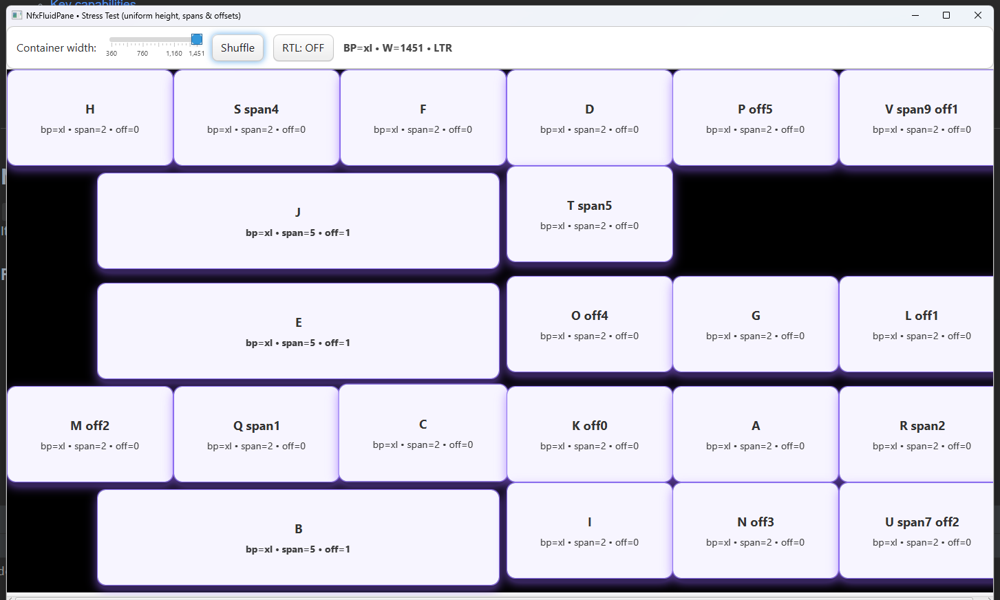
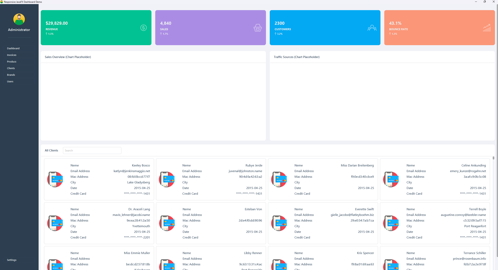
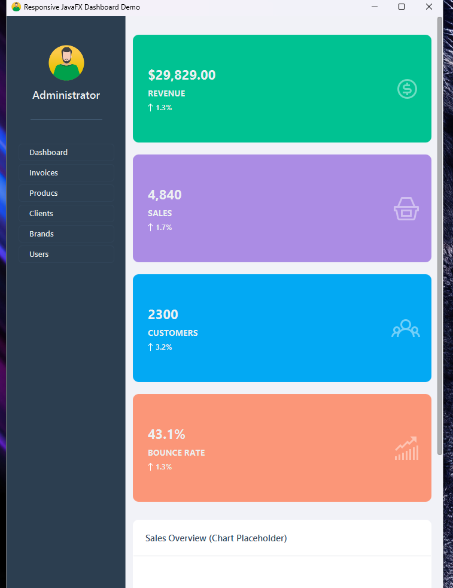
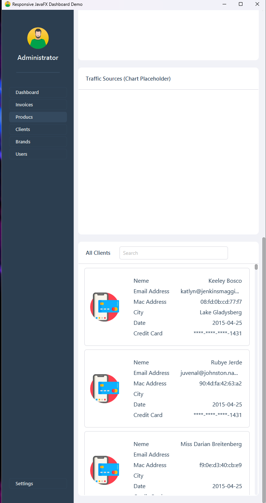

# Nfx Responsive Toolkit for JavaFX
**Primary:** `NfxFluidPane` — CSS‑driven, responsive fluid grid  
**Also included:** `NfxGridListView` (keyboard‑first virtualized grid list), `NfxGridLayout` (breakpoint grid for `NfxGridItem`)

No global scene hooks, no surprise side effects — everything is scoped to the control.

---

## Table of Contents
1. [NfxFluidPane (Primary)](#nfxfluidpane-primary)
    - [Features](#features)
    - [Quick Start](#quick-start)
    - [Breakpoints](#breakpoints)
    - [Layout Properties (CSS)](#layout-properties-css)
    - [CSS Examples](#css-examples)
    - [Programmatic API](#programmatic-api)
    - [Precedence & Resolution](#precedence--resolution)
    - [Tips & Troubleshooting](#tips--troubleshooting)
2. [NfxGridListView](#nfxgridlistview)
    - [Purpose](#purpose-1)
    - [Key capabilities](#key-capabilities)
    - [Navigation and shortcuts](#navigation-and-shortcuts)
    - [Focus and selection model](#focus-and-selection-model)
    - [Scrolling and visibility](#scrolling-and-visibility)
    - [Styling hooks](#styling-hooks)
    - [Integration tips](#integration-tips)
3. [NfxGridLayout](#nfxgridlayout)
    - [Purpose](#purpose-2)
    - [Critical requirement](#critical-requirement)
    - [Key capabilities](#key-capabilities-1)
    - [How it lays out](#how-it-lays-out)
    - [Styling hooks](#styling-hooks-1)
4. [Demo & Screenshots](#demo--screenshots)
5. [Known limitations](#known-limitations)
6. [FAQ](#faq)

---

## NfxFluidPane (Primary)

`NfxFluidPane` is a fluid, multi‑column **12‑column** layout container for JavaFX.  
It arranges direct children into rows with Bootstrap‑like **spans**, **offsets**, and **margins**, and switches layouts at **breakpoints**: `xs`, `sm`, `md`, `lg`, `xl`, `xxl`.

### Features

- **6 Breakpoints**: `xs`, `sm`, `md`, `lg`, `xl`, `xxl` (fixed **12** columns).
- **Per‑child constraints** (set via **CSS** or **Java setters**):
    - `-col-span: <int>` — how many columns the child spans (1..12)
    - `-col-offset: <int>` — how many columns to skip before the child (0..11)
    - `-col-margin: <insets>` — CSS‑like margins: `a`, `v h`, `t h b`, `t r b l`
- **Pseudo‑class breakpoints**: write CSS like `.card:md { … }`, `.tile:xl { … }`.
- **Right‑to‑left aware**: respects `NodeOrientation.RIGHT_TO_LEFT` while preserving child order.
- **Order‑preserving / responsive packing**:
    - Keeps child order.
    - Wraps to the next row when the current row is full.
    - If `offset + span` would overflow an *empty* row, span is **shrunk to fit** the remaining columns.
- **Edge gutter clamp** (recommended pattern): zero left margin at column 0 and zero right margin at the last column to avoid outer gutters.
- **Last‑wins precedence** with **exact breakpoint override**: exact `.klass:md` rules override base `.klass` rules for the same property.

### Quick Start

```java
NfxFluidPane grid = new NfxFluidPane();
grid.getStyleClass().add("nfx-grid");

Label a = new Label("A");
Label b = new Label("B");
Label c = new Label("C");

grid.getChildren().addAll(a, b, c);

// Optionally set constraints in code
NfxFluidPane.setSmColSpan(a, 6);          // A takes 6/12 at sm+
NfxFluidPane.setSmColSpan(b, 6);          // B takes 6/12 at sm+
NfxFluidPane.setMdColOffset(c, 2);        // C offset by 2 cols at md+
NfxFluidPane.setMdColSpan(c, 4);          // C takes 4/12 at md+

// Attach a stylesheet that defines CSS utilities/skins
scene.getStylesheets().add(getClass().getResource("/responsive.css").toExternalForm());
```

### Breakpoints

| Key | Name        | Typical Target             |
|-----|-------------|----------------------------|
| xs  | Extra small | Phones                     |
| sm  | Small       | Large phones / small tabs  |
| md  | Medium      | Tablets                    |
| lg  | Large       | Small laptops              |
| xl  | X‑Large     | Desktops                   |
| xxl | XX‑Large    | Wide desktops              |

Grid width is divided into **12 equal columns** at every breakpoint.

### Layout Properties (CSS)

- `-col-span: <int>` — number of columns to span, clamped to `[1..12]`.
- `-col-offset: <int>` — left offset in columns, clamped to `[0..11]`.  
  *(Make sure your setter clamps to 0..11; don’t use MIN_COLS.)*
- `-col-margin: <insets>` — margins around the node (shorthand like CSS):
    - `a` → `top/right/bottom/left = a`
    - `v h` → `top/bottom = v`, `left/right = h`
    - `t h b` → `top = t`, `left/right = h`, `bottom = b`
    - `t r b l` → explicit four sides
    - Units: raw numbers or `px` (e.g., `8` or `8px`).

**Overflow rule:** If a row is empty and `offset + span > 12`, the span is **shrunk to fit** (`span = 12 − offset`).

**Edge gutters:** You may clamp outer gutters so the first column has **no left margin** and the last column has **no right margin**; gutters remain **between** items.

### CSS Examples



```css
/* Base grid skin (light) */
.nfx-grid { -fx-background-color: linear-gradient(to bottom, #fafafa, #f3f3f3); -fx-padding: 18; }

/* Generic tile visuals */
.box {
  -fx-background-color: #ffffff;
  -fx-border-color: rgba(0,0,0,0.18);
  -fx-border-radius: 12;
  -fx-background-radius: 12;
  -fx-padding: 16 14;
  -fx-effect: dropshadow(gaussian, rgba(0,0,0,0.10), 14, 0.25, 0, 5);
}

/* Layout utilities via custom properties */
.card:xs  { -col-span: 12; -col-margin: 6; }
.card:sm  { -col-span: 6;  -col-margin: 8; }   /* 2-up on sm */
.card:lg  { -col-span: 4;  -col-margin: 10; }  /* 3-up on lg+ */

.sidebar:xs { -col-span: 12; }
.sidebar:lg { -col-span: 3;  -col-offset: 1; }

/* Demo class that changes by breakpoint */
.demo:xs  { -col-span: 12; -col-margin: 6; }
.demo:sm  { -col-span: 8;  -col-margin: 8; }
.demo:md  { -col-span: 6;  -col-margin: 10; }
.demo:lg  { -col-span: 4;  -col-margin: 12; }
.demo:xl  { -col-span: 4;  -col-margin: 12; }
.demo:xxl { -col-span: 3;  -col-margin: 14; }

/* Visual skins per breakpoint (optional) */
.box:xs  { -fx-background-color: #fff7f6; -fx-border-color: #ff6f85; }
.box:sm  { -fx-background-color: #fffbed; -fx-border-color: #e6b800; }
.box:md  { -fx-background-color: #f2fff6; -fx-border-color: #2dbd2d; }
.box:lg  { -fx-background-color: #f4f9ff; -fx-border-color: #3399ff; }
.box:xl  { -fx-background-color: #f7f4ff; -fx-border-color: #8b6ff0; }
.box:xxl { -fx-background-color: #fff7ee; -fx-border-color: #ff8c2b; }
```

Attach classes to nodes:
```java
a.getStyleClass().addAll("box", "card");
b.getStyleClass().addAll("box", "card");
c.getStyleClass().addAll("box", "sidebar", "demo");
```

### Programmatic API

Each property can be set per breakpoint. Representative methods:

```java
// Spans (1..12)
NfxFluidPane.setXsColSpan(node, 12);
NfxFluidPane.setSmColSpan(node, 6);
NfxFluidPane.setMdColSpan(node, 4);
int spanMd = NfxFluidPane.getMdColSpan(node);

// Offsets (0..11)
NfxFluidPane.setXsColOffset(node, 0);
NfxFluidPane.setSmColOffset(node, 1);
int offSm = NfxFluidPane.getSmColOffset(node);

// Insets (margins) as JavaFX Insets
NfxFluidPane.setXsInsets(node, new Insets(6));
NfxFluidPane.setMdInsets(node, new Insets(8, 12, 8, 12));
Insets ins = NfxFluidPane.getLgInsets(node);
```

### Precedence & Resolution

- **Last‑wins:** If multiple rules match the same node and breakpoint, the rule declared **later** in the parsed stylesheets wins.
- **Exact bp beats base:** For the same class/property, `.klass:md` overrides `.klass` even if the base is later (use a priority boost when merging).

```css
.card { -col-span: 12; }   /* base */
.card:md { -col-span: 6; } /* exact bp:md wins on md */
```

### Tips & Troubleshooting

- **Left gap at xs:** Ensure `-col-offset: 0` isn’t clamped to 1. Offsets must clamp to **[0..11]**. Clamp outer gutters at column edges if you don’t want outside spacing.
- **Overflow at xs:** If `.klass:xs` sets `offset + span > 12`, the pane shrinks span to fit on an empty row.
- **Last row clipped in parent:** Let the pane update its preferred height (it computes the required total row height) and make sure the parent respects pref height (e.g., in `ScrollPane`, leave `fitToHeight` `false` or wrap accordingly).

---

## NfxGridListView

### Purpose
NfxGridListView displays items in a grid where the number of cells per row can change with available space. It emphasizes predictable keyboard behavior, one focused cell at a time, and clear selection semantics.

### Key capabilities
- **Grid‑aware navigation**: Up/Down move by the number of cells per row, Left/Right move within a row, with Home/End and Page Up/Down shortcuts.
- **Focus‑only cursoring**: Arrow keys move the focus without mutating selection, preventing unintended multi‑selection growth.
- **Deterministic range selection**: Shift + click replaces the current selection with the exact range between the anchor and the clicked cell.
- **Exclusive activation**: Enter selects the focused item exclusively (the previously selected items are cleared).
- **Select all**: Ctrl or Command + A selects all items at once.
- **Refresh**: F5 triggers a visual refresh and preserves the focused item’s visibility if it still exists.
- **Local‑only event handling**: Keyboard and mouse interactions are attached to the control itself, avoiding conflicts with other parts of your application.
- **Virtualization**: Only visible cells are realized; off‑screen cells are recycled to keep scrolling smooth.

### Navigation and shortcuts
- **Arrow keys**: Move focus only. Up/Down step by the current cells‑per‑row value; Left/Right step within a row.
- **Home / End**: Jump to the first or last cell of the current row.
- **Page Up / Page Down**: Move by an estimated number of visible rows.
- **Enter**: Activates exclusive selection for the focused cell.
- **Shift + Click**: Selects a contiguous range, replacing any items outside that range.
- **Ctrl or Command + A**: Selects all items.
- **F5**: Refreshes the view.

### Focus and selection model
- **Single focused cell**: A lightweight, item‑based focus model guarantees that at most one cell is visually focused at any time.
- **Selection model**: Supports single or multiple selection modes with atomic operations to replace the selection list, ensuring consistent results during range and select‑all actions.
- **Range anchor rule**: If a selection exists, the anchor is the most recently selected item; otherwise the focused item is used. The final range is always exactly between the anchor and the clicked cell.

### Scrolling and visibility
- The view keeps the focused cell visible by adjusting the scroll position when focus changes via keyboard.
- Page navigation uses a row‑estimate based on current viewport size, cell size, and spacing to feel natural.

### Styling hooks
- **Cell style class**: `grid-cell`.
- **Pseudo‑classes**: `selected`, `focused`, and (optionally) `pressed` if you toggle it from your cell logic.
- **Inner content coloring**: The styling model expects text and graphics inside each cell to change appearance when the cell is selected or focused. If you are using raw text nodes, ensure they are styled as descendants so they can inherit selected visuals.

### Integration tips
- Keep keyboard navigation focus‑only; perform selection on explicit activation (Enter) or by mouse gestures. This avoids “sticky” selections while navigating.
- If you support toggling by keyboard (for example, a modifier plus Space), apply selection changes atomically to avoid flicker and race conditions with default behaviors.
- Because event handling is local, this control won’t interfere with global shortcuts or other controls in your Scene.

---

## NfxGridLayout

### Purpose
NfxGridLayout is a responsive container that arranges content across breakpoints, similar to a CSS grid. It uses a 12‑column conceptual grid and recomputes layout when the container width crosses defined thresholds.

### Critical requirement
**Only NfxGridItem children are supported.** NfxGridItem carries the breakpoint properties (such as spans and optional visibility) that NfxGridLayout reads to perform responsive placement. Regular nodes are not accepted as direct children.

### Key capabilities
- **Breakpoint‑driven layout**: Items declare spans per breakpoint (for example, compact through extra‑large). As the container width changes, items reflow automatically.
- **12‑column grid**: Column spans are evaluated against a 12‑column model and wrap as needed to new rows.
- **Consistent rhythm**: Horizontal and vertical gaps and container padding produce a clean, predictable layout rhythm.
- **Visibility and ordering**: If provided by your NfxGridItem API, items may be shown or hidden per breakpoint and can influence placement order predictably.

### How it lays out
- The container listens to size changes and determines the active breakpoint.
- Each NfxGridItem contributes its span for the active breakpoint.
- Items are placed left‑to‑right, top‑to‑bottom, wrapping based on available columns, with gaps and padding respected.

### Styling hooks
- Apply styling to the content inside NfxGridItem as you would with standard JavaFX nodes. The layout itself focuses on structure and spacing rather than visuals.
- Keep typography and color concerns inside the item content so that breakpoint changes do not alter the visual language unexpectedly.

---

## Demo & Screenshots

### Demo Video
[](https://www.youtube.com/watch?v=TsJTyd2h_VM)

### Screenshots






---

## Known limitations

- `NfxGridLayout` requires `NfxGridItem` as direct children; other node types are not supported.
- `NfxGridListView` maintains only one focused cell by design to keep keyboard navigation predictable.
- Because all event handling is local to the controls, application‑wide shortcuts are unaffected. If you need global shortcuts, wire them at the application level.

---

## FAQ

**Why don’t arrow keys change selection in NfxGridListView?**  
To keep navigation predictable and avoid growing the selection by accident. Selection changes happen on explicit activation or by mouse selection gestures.

**Why does Shift + click replace the selection instead of extending it?**  
This control favors deterministic range selection. The result is always the contiguous range between the anchor and the clicked cell, with everything else cleared.

**Can I change how selected cells look?**  
Yes. Use the `grid-cell` style class and pseudo‑classes such as `selected` and `focused`. Ensure your inner text and graphics are styled as descendants so they reflect the selected state.

**What happens to focus during refresh?**  
The view attempts to keep the previously focused item visible and focused if it still exists after refresh.